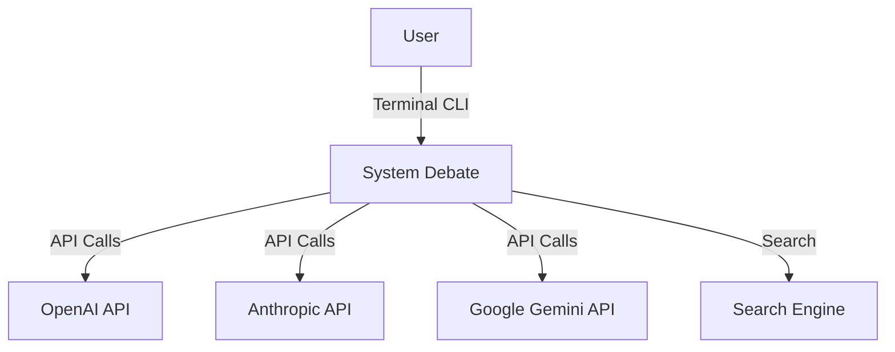
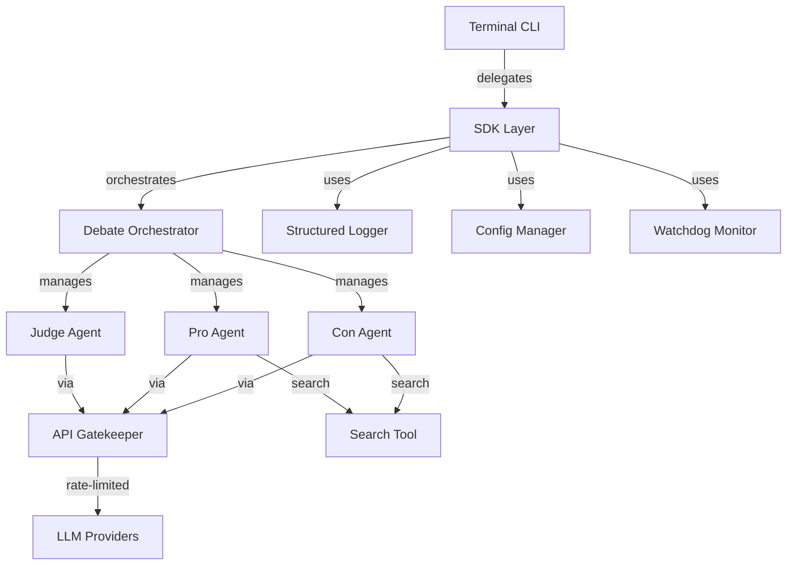
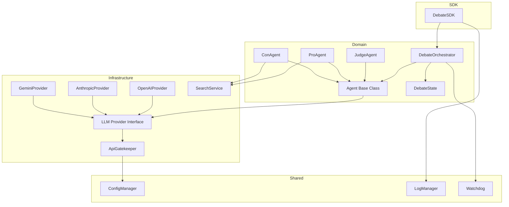
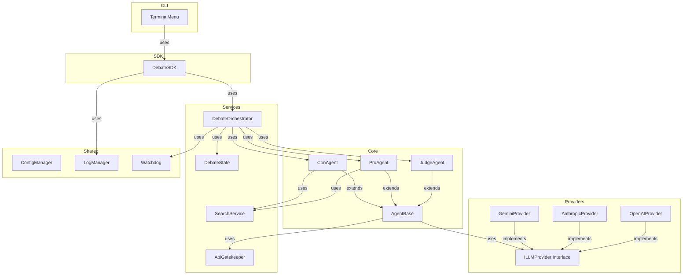

# PLAN — AI Debate System Architecture

## C4 Model

### Context Diagram



### Container Diagram



### Component Diagram



## Architecture Design

### OOP Class Hierarchy



### Key Classes

| Class | Responsibility |
|-------|---------------|
| `AgentBase` | Abstract base for all agents; LLM call, prompt building, timeout |
| `JudgeAgent` | Enforces rules, scores persuasiveness, decides winner |
| `ProAgent` | Argues positive side; uses search for evidence |
| `ConAgent` | Argues negative side; uses search for evidence |
| `ILLMProvider` | Interface for LLM providers |
| `OpenAIProvider` | OpenAI API implementation |
| `AnthropicProvider` | Anthropic API implementation |
| `GeminiProvider` | Google Gemini API implementation |
| `ApiGatekeeper` | Rate limiting, queuing, retries |
| `SearchService` | Internet search abstraction |
| `DebateOrchestrator` | Manages debate flow and rounds |
| `DebateState` | Tracks debate state, arguments, scores |
| `DebateSDK` | Single entry point for all operations |
| `ConfigManager` | Loads and validates configuration |
| `LogManager` | Structured logging with FIFO rotation |
| `Watchdog` | Process monitoring and keep-alive |
| `TerminalMenu` | CLI menu interface |

### JSON Communication Format

```json
{
    "type": "argument",
    "agent": "pro",
    "round": 1,
    "content": "My argument here...",
    "references": ["source_url"],
    "timestamp": "2024-01-01T00:00:00Z"
}
```

### Configuration Schema

```json
{
    "version": "1.00",
    "debate": {
        "topic": "Real Madrid vs Barcelona - which is better?",
        "max_rounds": 10,
        "max_tokens_per_agent": 500,
        "request_timeout_seconds": 60
    },
    "agents": {
        "judge": {
            "provider": "openai",
            "model": "gpt-4o-mini",
            "temperature": 0.3
        },
        "pro": {
            "provider": "openai",
            "model": "gpt-4o-mini",
            "temperature": 0.7
        },
        "con": {
            "provider": "openai",
            "model": "gpt-4o-mini",
            "temperature": 0.7
        }
    },
    "gatekeeper": {
        "requests_per_minute": 30,
        "requests_per_hour": 500,
        "max_retries": 3,
        "retry_delay_seconds": 5
    },
    "logging": {
        "max_files": 20,
        "max_lines_per_file": 500,
        "log_directory": "logs"
    }
}
```

## ADRs

### ADR-001: LLM Provider Abstraction
**Decision**: Use interface-based LLM provider abstraction
**Rationale**: LLM provider-agnostic requirement; allows swapping providers via config
**Trade-offs**: More initial code; simpler long-term maintenance

### ADR-002: JSON Communication
**Decision**: All inter-agent communication via JSON
**Rationale**: Structured, monitorable, token-efficient per requirements
**Trade-offs**: Less natural than free text; requires prompt engineering

### ADR-003: Judge as Mediator
**Decision**: All messages flow through Judge
**Rationale**: Requirement; allows Judge to enforce rules and prevent agreement

### ADR-004: Duckduckgo Search
**Decision**: Use DuckDuckGo for free, no-key search
**Rationale**: No API key needed; sufficient for citation purposes

## Project Structure

```
skills-test/
├── src/
│   └── debate/
│       ├── __init__.py
│       ├── sdk/
│       │   └── sdk.py
│       ├── services/
│       │   ├── orchestrator.py
│       │   ├── debate_state.py
│       │   └── search_service.py
│       ├── agents/
│       │   ├── base_agent.py
│       │   ├── judge_agent.py
│       │   ├── pro_agent.py
│       │   └── con_agent.py
│       ├── providers/
│       │   ├── base_provider.py
│       │   ├── openai_provider.py
│       │   ├── anthropic_provider.py
│       │   └── gemini_provider.py
│       ├── shared/
│       │   ├── gatekeeper.py
│       │   ├── config.py
│       │   ├── logger.py
│       │   └── watchdog.py
│       ├── cli/
│       │   └── menu.py
│       └── constants.py
├── tests/
│   ├── unit/
│   │   ├── test_agents/
│   │   ├── test_providers/
│   │   ├── test_services/
│   │   ├── test_shared/
│   │   └── test_sdk/
│   └── integration/
│       ├── test_debate_flow.py
│       └── conftest.py
├── config/
│   ├── setup.json
│   ├── rate_limits.json
│   └── logging_config.json
├── docs/
│   ├── PRD.md
│   ├── PLAN.md
│   └── TODO.md
├── README.md
├── pyproject.toml
├── .env-example
├── .gitignore
└── src/main.py
```
